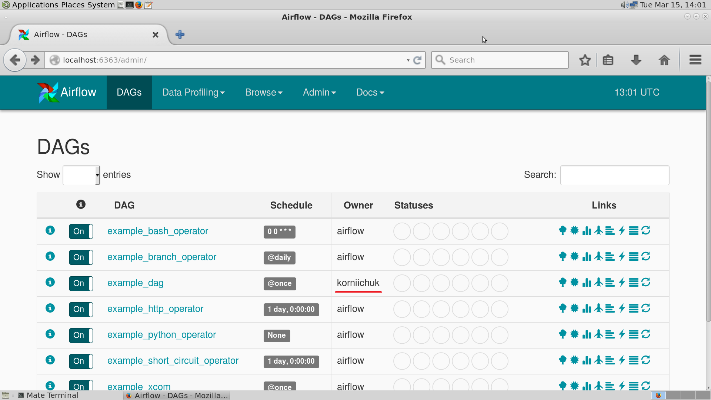
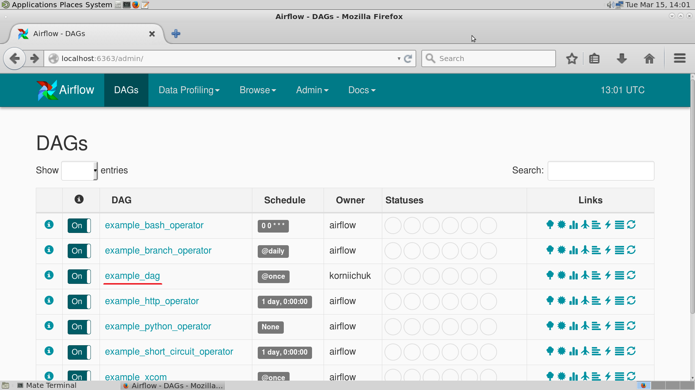
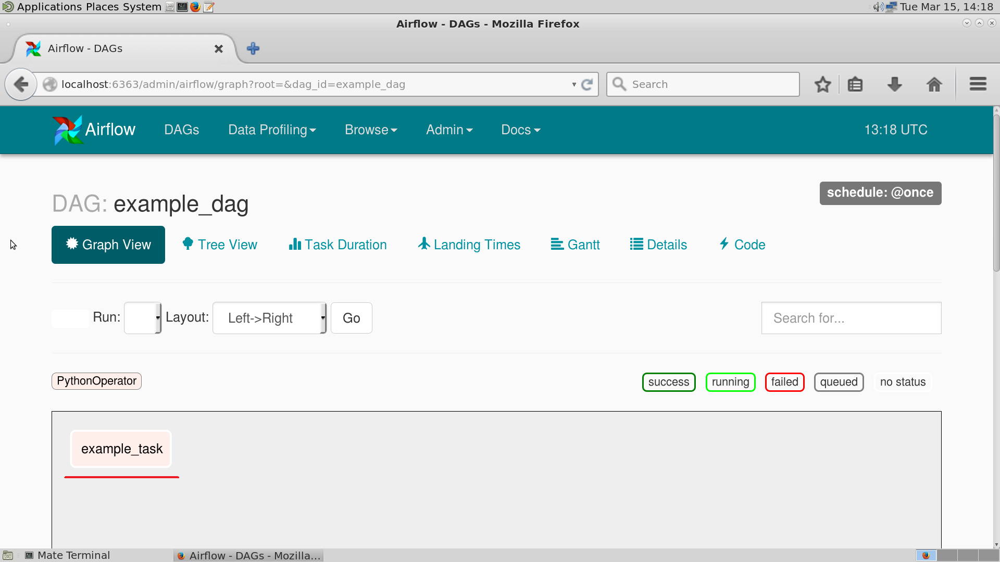

.. contents:: Table of contents
   :depth: 3

Airflow
=======

Introduction
------------
Airflow is a platform to programmatically author, schedule and monitor workflows.

Use airflow to author workflows as DAGs (Directed Acyclic Graphs) of tasks.
The airflow scheduler executes your tasks on an array of workers while following the specified dependencies.
Rich command line utilities make performing complex surgeries on DAGs a snap.
The rich user interface makes it easy to visualize pipelines running in production, monitor progress, and troubleshoot issues when needed.

Operators
^^^^^^^^^
Operators allow for generation of certain types of tasks that become nodes in the DAG when instantiated. All operators derive from ``BaseOperator`` and inherit many attributes and methods that way.
There are 3 main types of operators:

* Operators that performs an **action**, or tell another system to perform an action,
* **Transfer** operators move data from one system to another,
* **Sensors** are a certain type of operator that will keep running until a certain criterion is met. Sensors are derived from ``BaseSensorOperator`` and run a poke method at a specified ``poke_interval`` until it returns ``True``.

Python operator
---------------
Create Python script::

    $ mkdir <airflow_home>/dags
    $ touch <airflow_home>/dags/<filename>.py

Where:

* ``<airflow_home>`` -- airflow home dir path,
* ``<filename>`` -- filename of Python script.

Example::

    $ mkdir /home/test_user/airflow/dags
    $ touch /home/test_user/airflow/dags/example.py

Importing modules
^^^^^^^^^^^^^^^^^
::

    from airflow.models import DAG
    from airflow.operators import PythonOperator

Default arguments
^^^^^^^^^^^^^^^^^
::

    default_args = {
            "owner": <owner>,
            "email": <email>,
            "email_on_retry": <email_on_retry>,
            "email_on_failure": <email_on_failure>,
            "template_searchpath": <template_searchpath>,
            "user_defined_macros": <user_defined_macros>,
            "concurrency": <concurrency>,
            "max_active_runs": <max_active_runs>,
            "sla_miss_callback": <sla_miss_callback>,
            "sla": <sla>,
            "trigger_rule": <trigger_rule>
    }

Where:

* ``<owner>`` *(string)* -- the owner of the task, using the unix username is recommended,
* ``<template_searchpath>`` *(string or list of stings)* -- this list of folders (non relative) defines where Jinja will look for your templates,
* ``<user_defined_macros>`` *(dict)* -- a dictionary of macros that will be exposed in your Jinja templates,
* ``<concurrency>`` *(int)* -- the number of task instances allowed to run concurrently,
* ``<max_active_runs>`` *(int)* -- maximum number of active DAG runs, beyond this number of DAG runs in a running state, the scheduler won't create new active DAG runs,
* ``<sla_miss_callback>`` *(types.FunctionType)* -- specify a function to call when reporting SLA timeouts,
* ``<sla>`` *(datetime.timedelta)* -- time by which the job is expected to succeed,
* ``<trigger_rule>`` *(str)* -- defines the rule by which dependencies are applied for the task to get triggered. Options are: ``all_success``, ``all_failed``, ``all_done``, ``one_success``, ``one_failed`` or ``dummy``.

Example::

    from datetime import datetime

    default_args = {
            "owner": "korniichuk",
            "email": ["ruslan.korniichuk@gmail.com"]
    }

.. note:: We can filter the list of DAGs in webserver by owner name, when authentication is turned on, by setting ``filter_by_owner`` as ``True`` in our ``~/airflow/airflow.cfg``.

Instantiate a DAG
^^^^^^^^^^^^^^^^^
::

    class airflow.models.DAG(dag_id,
            schedule_interval=datetime.timedelta(1), start_date=None,
            end_date=None, full_filepath=None, template_searchpath=None,
            user_defined_macros=None, default_args=None, concurrency=16,
            max_active_runs=16, dagrun_timeout=None,
            sla_miss_callback=None, params=None)

    dag = DAG(
            dag_id=<dag_id>,
            schedule_interval=<schedule_interval>,
            start_date=<start_date>,
            end_date=<end_date>,
            default_args=<default_args>,
            dagrun_timeout=<dagrun_timeout>)

Where:

* ``<dag_id>`` *(string)* -- the id of the DAG,
* ``<schedule_interval>`` *(datetime.timedelta or dateutil.relativedelta.relativedelta or str that acts as a cron expression)* -- defines how often that DAG runs,
* ``<start_date>`` *(datetime.datetime)* -- the timestamp from which the scheduler will attempt to backfill,
* ``<end_date>`` *(datetime)* -- if specified, the scheduler won't go beyond this date,
* ``<default_args>`` *(dict)* -- a dictionary of default parameters to be used as constructor keyword parameters when initialising operators,
* ``<dagrun_timeout>`` *(datetime.timedelta)* -- specify how long a DagRun should be up before timing out / failing, so that new DagRuns can be created.

Example::

    dag = DAG(
            dag_id="example_dag",
            schedule_interval="@once",
            start_date=datetime(2016, 3, 22),
            default_args=default_args)

**Schedule intervals**

+------------+----------------------------------------------------------------+
|preset      |description                                                     |
+============+================================================================+
|``None``    |Don't schedule, use for exclusively "externally triggered" DAGs.|
+------------+----------------------------------------------------------------+
|``@once``   |Schedule once and only once.                                    |
+------------+----------------------------------------------------------------+
|``@hourly`` |Run once an hour at the beginning of the hour.                  |
+------------+----------------------------------------------------------------+
|``@daily``  |Run once a day at midnight.                                     |
+------------+----------------------------------------------------------------+
|``@weekly`` |Run once a week at midnight on Sunday morning.                  |
+------------+----------------------------------------------------------------+
|``@monthly``|Run once a month at midnight of the first day of the month.     |
+------------+----------------------------------------------------------------+
|``@yearly`` |Run once a year at midnight of January 1.                       |
+------------+----------------------------------------------------------------+

Tasks
^^^^^
::

    class airflow.models.BaseOperator(task_id, owner, email=None,
            email_on_retry=True, email_on_failure=True, retries=0,
            retry_delay=datetime.timedelta(0, 300), start_date=None,
            end_date=None, schedule_interval=None,
            depends_on_past=False, wait_for_downstream=False, dag=None,
            params=None, default_args=None, adhoc=False,
            priority_weight=1, queue='default', pool=None, sla=None,
            execution_timeout=None, on_failure_callback=None,
            on_success_callback=None, on_retry_callback=None,
            trigger_rule=u'all_success', *args, **kwargs)

    class airflow.operators.PythonOperator(python_callable,
            op_args=None, op_kwargs=None, provide_context=False,
            templates_dict=None, templates_exts=None, *args, **kwargs)

    task = PythonOperator(
            task_id=<task_id>,
            retries=<retries>,
            retry_delay=<retry_delay>,
            depends_on_past=<depends_on_past>,
            wait_for_downstream=<wait_for_downstream>,
            dag=<dag>,
            default_args=<default_args>,
            priority_weight=<priority_weight>,
            queue=<queue>,
            pool=<pool>,
            execution_timeout=<execution_timeout>,
            on_failure_callback=<on_failure_callback>,
            on_retry_callback=<on_retry_callback>,
            on_success_callback=<on_success_callback>,
            python_callable=<python_callable>)

Where:

* ``<task_id>`` *(string)* -- a unique, meaningful id for the task,
* ``<retries>`` *(int)* -- the number of retries that should be performed before failing the task,
* ``<retry_delay>`` *(timedelta)* delay between retries,
* ``<depends_on_past>`` *(bool)* -- when set to ``True``, task instances will run sequentially while relying on the previous task's schedule to succeed. The task instance for the ``start_date`` is allowed to run,
* ``<wait_for_downstream>`` *(bool)* -- when set to ``True``, an instance of task X will wait for tasks immediately downstream of the previous instance of task X to finish successfully before it runs. Note that ``depends_on_past`` is forced to ``True`` wherever ``wait_for_downstream`` is used,
* ``<dag>`` *(DAG)* -- a reference to the DAG the task is attached to (if any),
* ``<default_args>`` *(dict)* -- a dictionary of default parameters to be used as constructor keyword parameters when initialising operators,
* ``<priority_weight>`` *(int)* -- priority weight of this task against other task. This allows the executor to trigger higher priority tasks before others when things get backed up,
* ``<queue>`` *(str)* -- which queue to target when running this job. Not all executors implement queue management, the ``CeleryExecutor`` does support targeting specific queues,
* ``<pool>`` *(str)* -- the slot pool this task should run in, slot pools are a way to limit concurrency for certain tasks,
* ``<execution_timeout>`` *(datetime.timedelta)* -- max time allowed for the execution of this task instance, if it goes beyond it will raise and fail,
* ``<on_failure_callback>`` *(callable)* -- a function to be called when a task instance of this task fails,
* ``<on_retry_callback>`` *(callable)* -- much like the ``on_failure_callback`` excepts that it is executed when retries occur,
* ``<on_success_callback>`` *(callable)* -- much like the ``on_failure_callback`` excepts that it is executed when the task succeeds,
* ``<python_callable>`` *(python callable)* -- a reference to an object that is callable.

Example::

    def example_func():
        pass

    task = PythonOperator(
            task_id="example_task",
            dag=dag,
            default_args=default_args,
            python_callable=example_func)

Express
^^^^^^^
::

    from datetime import datetime

    from airflow.models import DAG
    from airflow.operators import PythonOperator

    default_args = {
            "owner": "korniichuk",
            "email": ["ruslan.korniichuk@gmail.com"]
    }

    dag = DAG(
            dag_id="example_dag",
            schedule_interval="@once",
            start_date=datetime(2016, 3, 22),
            default_args=default_args)

    def example_func():
        pass

    task = PythonOperator(
            task_id="example_task",
            dag=dag,
            default_args=default_args,
            python_callable=example_func)

Run DAG
^^^^^^^
::

    $ airflow scheduler [-d <dag_id>]

Where:

* ``-d <dag_id>`` or ``--dag_id <dag_id>`` -- the id of the DAG to run.

Example::

    $ airflow scheduler -d example_dag

Parameters
^^^^^^^^^^
::

    class airflow.operators.PythonOperator(python_callable, op_args=None,
            op_kwargs=None, provide_context=False, templates_dict=None,
            templates_exts=None, *args, **kwargs)

Where:

* ``python_callable`` *(python callable)* -- a reference to an object that is callable,
* ``op_args`` *(list)* -- a list of positional arguments that will get unpacked when calling your callable,
* ``op_kwargs`` *(dict)* --  a dictionary of keyword arguments that will get unpacked in your function,
* ``provide_context`` *(bool)* -- if set to ``True``, Airflow will pass a set of keyword arguments that can be used in your function. This set of kwargs correspond exactly to what you can use in your Jinja templates. For this to work, you need to define ``**kwargs`` in your function header,
* ``templates_dict`` *(dict of str)* -- a dictionary where the values are templates,
* ``templates_exts`` *(list)* -- a list of file extensions to resolve while processing templated fields, for examples ``['.sql', '.hql']``.

Bash operator
-------------
Parameters
^^^^^^^^^^
::

    class airflow.operators.BashOperator(bash_command, xcom_push=False,
            env=None, output_encoding='utf-8', *args, **kwargs)

Where:

* ``bash_command`` *(string)* -- the command, set of commands or reference to a bash script (must be '.sh') to be executed,
* ``xcom_push`` *(bool)* -- make an XCom available for tasks to pull,
* ``env`` *(dict)* -- if ``env`` is not ``None``, it must be a mapping that defines the environment variables for the new process.

Example 1::

    from datetime import datetime

    from airflow.models import DAG
    from airflow.operators import BashOperator

    default_args = {
            "owner": "korniichuk"
    }

    dag = DAG(
            dag_id="example_dag",
            schedule_interval="@once",
            start_date=datetime(2016, 3, 22),
            default_args=default_args)

    task = BashOperator(
            task_id="example_task",
            dag=dag,
            default_args=default_args,
            bash_command="who")

Example 2::

    from datetime import datetime

    from airflow.models import DAG
    from airflow.operators import BashOperator

    default_args = {
            "owner": "korniichuk",
            "email": ["ruslan.korniichuk@gmail.com"],
    }

    dag = DAG(
            dag_id="example_dag13",
            schedule_interval="@once",
            start_date=datetime(2016, 3, 22),
            default_args=default_args)

    task = BashOperator(
            task_id="example_task",
            dag=dag,
            default_args=default_args,
            bash_command="example.sh")

File ``~/airflow/dags/example.sh``::

    #!/bin/bash

    who

User guide
----------
Setting up dependencies
^^^^^^^^^^^^^^^^^^^^^^^
::

    task1 = BashOperator(
            task_id="task1",
            dag=dag,
            bash_command="who")

    task2 = BashOperator(
            task_id="task2",
            dag=dag,
            bash_command="uname")

We have two simple tasks that do not depend on each other.
Here's a few ways you can define dependencies between them::

    task2.set_upstream(task1)

or::

    task1.set_downstream(task2)

or::

    dag.set_dependency("task1", "task2")

Templating with Jinja
^^^^^^^^^^^^^^^^^^^^^
Airflow leverages the power of `Jinja <http://jinja.pocoo.org/docs/dev/>`_ templating and provides the pipeline author with a set of built-in parameters and macros.
::

    templated_command = """
    
        echo "{{ params.text }}"
    

    """

    task = BashOperator(
            task_id="task",
            dag=dag,
            params={"text": "Hello, World!"},
            bash_command=templated_command)

Configuring parallelism
^^^^^^^^^^^^^^^^^^^^^^^

Open ``~/airflow/airflow.cfg`` file::

    $ nano ~/airflow/airflow.cfg

Modify next lines::

    parallelism = <parallelism>
    dag_concurrency = <dag_concurrency>
    max_active_runs_per_dag = <max_active_runs_per_dag>

Where:

* ``<parallelism>`` -- number of physical python processes the scheduler can run,
* ``<dag_concurrency>`` -- number of task instances to be allowed to run per DAG at once,
* ``<max_active_runs_per_dag>`` --  number of dag runs (per DAG) to allow running at once.

Command line interface
----------------------
Run subsections of a DAG for a specified date range
^^^^^^^^^^^^^^^^^^^^^^^^^^^^^^^^^^^^^^^^^^^^^^^^^^^
::

    $ airflow backfill [-h] [-t <task_regex>] [-s <start_date>] [-e <end_date>] \
    [-m] [-l] [-x] [-a] [-i] [-sd <subdir>] [-p <pool>] [-dr] \
    dag_id

Where:

* ``-h`` or ``--help`` -- show this help message and exit,
* ``-t <task_regex>`` or ``--task_regex <task_regex>`` -- the regex to filter specific task_ids to backfill (optional),
* ``-s <start_date>`` or ``--start_date <start_date>`` -- override ``start_date``,
* ``-e <end_date>`` or ``--end_date <end_date>`` -- override ``end_date``,
* ``-m`` or ``--mark_success`` -- mark jobs as succeeded without running them,
* ``-l`` or ``--local`` -- run the task using the ``LocalExecutor``,
* ``-x`` or ``--donot_pickle`` -- do not attempt to pickle the DAG object to send over to the workers, just tell the workers to run their version of the code,
* ``-a`` or ``--include_adhoc`` -- include DAGs with the adhoc parameter,
* ``-i`` or ``--ignore_dependencies`` -- skip upstream tasks, run only the tasks matching the regexp. Only works in conjunction with ``task_regex``,
* ``-sd <subdir>`` or ``--subdir <subdir>`` -- file location or directory from which to look for the DAG,
* ``-p <pool>`` or ``--pool <pool>`` -- pool to use to run the backfill,
* ``-dr`` or ``--dry_ru`` -- perform a dry run,
* ``<dag_id>`` -- the id of the DAG to run.

``backfill`` will respect your dependencies, emit logs into files and talk to the database to record status. If you do have a webserver up, you'll be able to track the progress.

``backfill`` job doesn't actually use the ``schedule_interval`` to determine if/when it should be run.
Instead it will look at the ``start_date`` and ``end_date`` that you passed in and determine if it's in that range. If valid, then the DAG will start running. 

.. note:: If you use ``depends_on_past=True``, individual task instances will depend on the success of the preceding task instance, except for the ``start_date`` specified itself, for which this dependency is disregarded.

Clear a set of task instance, as if they never ran
^^^^^^^^^^^^^^^^^^^^^^^^^^^^^^^^^^^^^^^^^^^^^^^^^^
::

    $ airflow clear [-h] [-t <task_regex>] [-s <start_date>] [-e <end_date>] [-u]
    [-f] [-r] [-d] [-sd <subdir>] [-c]
    <dag_id>

Where:

* ``-h`` or ``--help`` -- show this help message and exit,
* ``-t <task_regex>`` or ``--task_regex <task_regex>`` -- the regex to filter specific task_ids to clear (optional),
* ``-s <start_date>`` or ``--start_date <start_date>`` -- override ``start_date``,
* ``-e <end_date>`` or ``--end_date <end_date>`` -- override ``end_date``,
* ``-u`` or ``--upstream`` -- include upstream tasks,
* ``-f`` or ``--only_failed`` -- only failed jobs,
* ``-r`` or ``--only_running`` -- only running jobs,
* ``-d`` or ``--downstream`` -- include downstream tasks,
* ``-sd <subdir>`` or ``--subdir <subdir>`` -- file location or directory from which to look for the DAG,
* ``-c`` or ``--no_confirm`` -- do not request confirmation,
* ``<dag_id>`` -- the id of the DAG to run.

Start a Celery Flower
^^^^^^^^^^^^^^^^^^^^^
::

    $ airflow flower [-h] [-p <port>] [-a <broker_api>]

Where:

* ``-h`` or ``--help`` -- show this help message and exit,
* ``-p <port>`` or ``--port <port>`` -- the port,
* ``-a <broker_api>`` or ``--broker_api <broker_api>`` -- broker api.

Initialize the metadata database
^^^^^^^^^^^^^^^^^^^^^^^^^^^^^^^^
::

    $ airflow initdb [-h]

Where:

* ``-h`` or ``--help`` -- show this help message and exit.

Start a kerberos ticket renewer
^^^^^^^^^^^^^^^^^^^^^^^^^^^^^^^
::

    $ airflow kerberos [-h] [-kt [<keytab>]] [<principal>]

Where:

* ``-h`` or ``--help`` -- show this help message and exit,
* ``-kt <keytab>`` or ``--keytab <keytab>`` -- keytab,
* ``<principal>`` -- kerberos principal.

List the DAGs
^^^^^^^^^^^^^
::

    $ airflow list_dags [-h] [-sd <subdir>]

Where:

* ``-h`` or ``--help`` -- show this help message and exit,
* ``-sd <subdir>`` or ``--subdir <subdir>`` -- file location or directory from which to look for the DAG.

List the tasks within a DAG
^^^^^^^^^^^^^^^^^^^^^^^^^^^
::

    $ airflow list_tasks [-h] [-t] [-sd <subdir>] <dag_id>

Where:

* ``-h`` or ``--help`` -- show this help message and exit,
* ``-t`` or ``--tree`` -- tree view,
* ``-sd <subdir>`` or ``--subdir <subdir>`` -- file location or directory from which to look for the DAG,
* ``<dag_id>`` -- the id of the DAG.

Pause a DAG
^^^^^^^^^^^
::

    $ airflow pause [-h] [-sd <subdir>] <dag_id>

Where:

* ``-h`` or ``--help`` -- show this help message and exit,
* ``-sd <subdir>`` or ``--subdir <subdir>`` -- file location or directory from which to look for the DAG,
* ``<dag_id>`` -- the id of the DAG to pause.

Render a task instance's template/templates
^^^^^^^^^^^^^^^^^^^^^^^^^^^^^^^^^^^^^^^^^^^
::

    $ airflow render [-h] [-sd <subdir>] <dag_id> <task_id> <execution_date>

Where:

* ``-h`` or ``--help`` -- show this help message and exit,
* ``-sd <subdir>`` or ``--subdir <subdir>`` -- file location or directory from which to look for the DAG,
* ``<dag_id>`` -- the id of the DAG to check,
* ``<task_id>`` -- the task_id to check,
* ``<execution_date>`` -- the execution date to check.

Burn down and rebuild the metadata database
^^^^^^^^^^^^^^^^^^^^^^^^^^^^^^^^^^^^^^^^^^^
::

    $ airflow resetdb [-h] [-y]

Where:

* ``-h`` or ``--help`` -- show this help message and exit,
* ``-y`` or ``--yes`` -- do not prompt to confirm reset. Use with care!

Run a single task instance
^^^^^^^^^^^^^^^^^^^^^^^^^^
::

    $ airflow run [-h] [-sd <subdir>] [-s <task_start_date>] [-m] [-f] [-l] \
    [--pool <pool>] [-i] [--ship_dag] [-p <pickle>] \
    <dag_id> <task_id> <execution_date>

Where:

* ``-h`` or ``--help`` -- show this help message and exit,
* ``-sd <subdir>`` or ``--subdir <subdir>`` -- file location or directory from which to look for the DAG,
* ``-s <task_start_date>`` or ``--task_start_date <task_start_date>`` -- override the tasks's ``start_date`` (used internally),
* ``m`` or ``--mark_success`` -- mark jobs as succeeded without running them,
* ``-f`` or ``--force`` -- force a run regardless or previous success,
* ``-l`` or ``--local`` -- runs the task locally, don't use the executor,
* ``--pool <pool>`` -- pool to use to run the task instance,
* ``-i`` or ``--ignore_dependencies`` -- ignore ``upstream`` and ``depends_on_past`` dependencies,
* ``--ship_dag`` -- pickles (serializes) the DAG and ships it to the worker,
* ``-p <pickle>`` or ``--pickle <pickle>`` -- serialized pickle object of the entire DAG (used internally),
* ``<dag_id>`` -- the id of the dag to run,
* ``<task_id>`` -- the ``task_id`` to run,
* ``<execution_date>`` -- the execution date to run.

Serve logs generate by worker
^^^^^^^^^^^^^^^^^^^^^^^^^^^^^
::

    $ airflow serve_logs [-h]

Where:

* ``-h`` or ``--help`` -- show this help message and exit.

Start a scheduler instance
^^^^^^^^^^^^^^^^^^^^^^^^^^^
::

    $ airflow scheduler [-h] [-d <dag_id>] [-sd <subdir>] [-n <num_runs>] [-p]

Where:

* ``-h`` or ``--help`` -- show this help message and exit,
* ``-d <dag_id>`` or ``--dag_id <dag_id>`` -- the id of the DAG to run,
* ``-sd <subdir>`` or ``--subdir <subdir>`` -- file location or directory from which to look for the DAG,
* ``-n <num_runs>`` or ``--num_runs <num_runs>`` -- set the number of runs to execute before exiting,
* ``-p`` or ``--do_pickle`` -- attempt to pickle the DAG object to send over to the workers, instead of letting workers run their version of the code.

Get the status of a task instance
^^^^^^^^^^^^^^^^^^^^^^^^^^^^^^^^^
::

    $ airflow task_state [-h] [-sd <subdir>] <dag_id> <task_id> <execution_date>

Where:

* ``-h`` or ``--help`` -- show this help message and exit,
* ``-sd <subdir>`` or ``--subdir <subdir>`` -- file location or directory from which to look for the DAG,
* ``<dag_id>`` -- the id of the DAG to check,
* ``<task_id>`` -- the task_id to check,
* ``<execution_date>`` -- the execution date to check.

Test a task instance
^^^^^^^^^^^^^^^^^^^^
::

    $ airflow test [-h] [-sd <subdir>] [-dr] <dag_id> <task_id> <execution_date>

Where:

* ``-h`` or ``--help`` -- show this help message and exit,
* ``-sd <subdir>`` or ``--subdir <subdir>`` -- file location or directory from which to look for the DAG,
* ``-dr`` or ``--dry_run`` -- perform a dry run,
* ``<dag_id>`` -- the id of the DAG to run,
* ``<task_id>`` -- the ``task_id`` to run,
* ``<execution_date>`` -- the execution date to run.

Trigger a DAG
^^^^^^^^^^^^^
::

    $ airflow trigger_dag [-h] [-r <run_id>] <dag_id>

Where:

* ``-h`` or ``--help`` -- show this help message and exit,
* ``-r <run_id>`` or ``--run_id <run_id>`` -- helps to indentify this run,
* ``<dag_id>`` -- the id of the DAG to run.

Unpause a DAG
^^^^^^^^^^^^^
::

    $  airflow unpause [-h] [-sd <subdir>] <dag_id>

Where:

* ``-h`` or ``--help`` -- show this help message and exit,
* ``-sd <subdir>`` or ``--subdir <subdir>`` -- file location or directory from which to look for the DAG,
* ``<dag_id>`` -- the id of the DAG to unpause.

Upgrade metadata database to latest version
^^^^^^^^^^^^^^^^^^^^^^^^^^^^^^^^^^^^^^^^^^^
::

    $ airflow upgradedb [-h]

Where:

* ``-h`` or ``--help`` -- show this help message and exit.

Show version
^^^^^^^^^^^^
::

    $ airflow version [-h]

Where:

* ``-h`` or ``--help`` -- show this help message and exit.

Start a Airflow webserver instance
^^^^^^^^^^^^^^^^^^^^^^^^^^^^^^^^^^
::

    $ airflow webserver [-h] [-p <port>] [-w <workers>] [-k <workerclass>}] \
    [-hn <hostname>] [-d]

Where:

* ``-h`` or ``--help`` -- show this help message and exit,
* ``-p <port>`` or ``--port <port>`` -- port on which to run the Airflow web server,
* ``-w <workers>`` or ``--workers <workers>`` -- number of workers to run the webserver on,
* ``-k <workerclass>`` or ``--workerclass <workerclass>`` -- the worker class to use for gunicorn. Possible choices: ``sync``, ``eventlet``, ``gevent`` or ``tornado``,
* ``-hn <hostname>`` or ``--hostname <hostname>`` -- set the hostname on which to run the web server,
* ``-d`` or ``--debug`` -- use the server that ships with Flask in debug mode.

Start a Celery worker node
^^^^^^^^^^^^^^^^^^^^^^^^^^
::

    $ airflow worker [-h] [-q <queues>] [-c <concurrency>]

Where:

* ``-h`` or ``--help`` -- show this help message and exit,
* ``-q <queues>`` or ``--queues <queues>`` -- comma delimited list of queues to serve,
* ``-c <concurrency>`` or ``--concurrency <concurrency>`` -- the number of worker processes.
